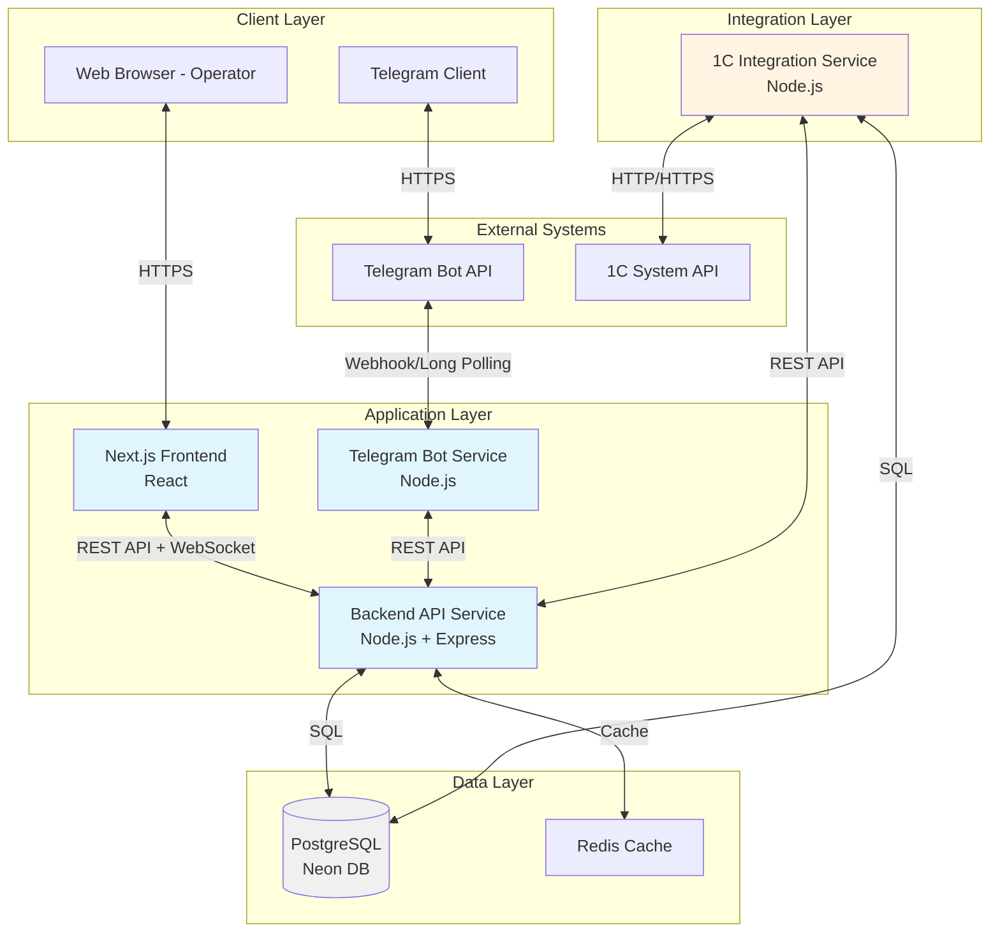
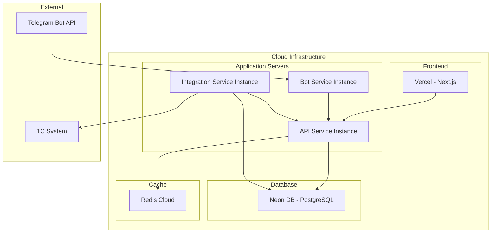
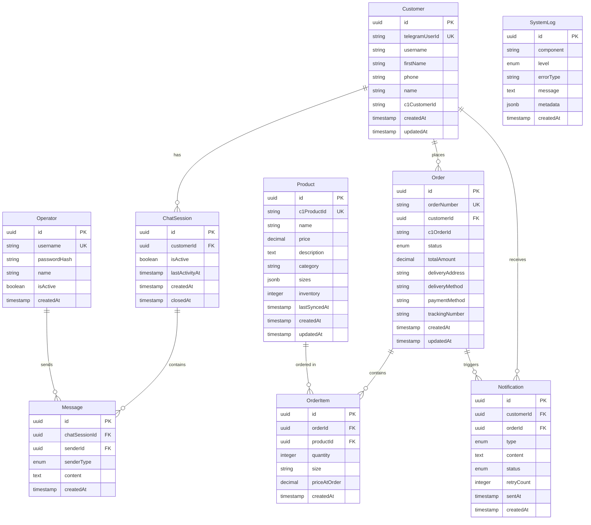

# Technical Design Document

## Overview

Система автоматизации клиентских коммуникаций представляет собой распределенное приложение, состоящее из следующих основных компонентов:

- **Telegram Bot Service** - сервис для взаимодействия с клиентами через Telegram Bot API
- **Backend API Service** - REST API для управления данными и бизнес-логикой
- **Web Interface** - React/Next.js приложение для операторов
- **1C Integration Service** - сервис синхронизации с системой учета 1С
- **PostgreSQL Database** - централизованное хранилище данных (Neon DB)

Система обеспечивает асинхронную обработку сообщений, автоматические уведомления клиентов и двустороннюю синхронизацию данных с 1С.

### Key Design Decisions

1. **Микросервисная архитектура**: Разделение на независимые сервисы (Telegram Bot, Backend API, 1C Integration) обеспечивает масштабируемость и независимое развертывание компонентов.

2. **Event-driven communication**: Использование событийной модели для обработки изменений статусов заказов и отправки уведомлений обеспечивает слабую связанность компонентов.

3. **Кэширование данных 1С**: Локальное кэширование данных о товарах и клиентах в PostgreSQL обеспечивает работу системы при недоступности 1С и снижает нагрузку на внешнюю систему.

4. **WebSocket для real-time**: Использование WebSocket соединений между Web Interface и Backend обеспечивает мгновенное отображение новых сообщений операторам.

5. **Retry механизмы**: Реализация повторных попыток для критических операций (отправка уведомлений, синхронизация с 1С) обеспечивает надежность системы.

## Architecture

### System Architecture Diagram



### Component Interaction Flow

**Customer Message Flow:**
1. Customer sends message → Telegram Bot API
2. Telegram Bot API → Telegram Bot Service (webhook)
3. Telegram Bot Service → Backend API (POST /messages)
4. Backend API → PostgreSQL (store message)
5. Backend API → Web Interface (WebSocket notification)
6. Operator sees message in real-time

**Order Creation Flow:**
1. Customer confirms order → Telegram Bot Service
2. Telegram Bot Service → Backend API (POST /orders)
3. Backend API → PostgreSQL (create order)
4. Backend API → 1C Integration Service (POST /1c/orders)
5. 1C Integration Service → 1C System API
6. Backend API → Telegram Bot Service (send confirmation)
7. Telegram Bot Service → Customer (order confirmation)

**Notification Flow:**
1. 1C Integration Service polls 1C System (every 5 min)
2. Detects order status change
3. 1C Integration Service → Backend API (PUT /orders/:id/status)
4. Backend API triggers notification event
5. Backend API → Telegram Bot Service (POST /notifications)
6. Telegram Bot Service → Customer (status notification)

### Deployment Architecture



## Components and Interfaces

### 1. Telegram Bot Service

**Responsibilities:**
- Receive messages from Telegram Bot API via webhook
- Send messages to customers via Telegram Bot API
- Handle bot commands (/start, /catalog, /order, /help)
- Implement automated responses for FAQ
- Forward complex queries to operators

**Technology Stack:**
- Node.js 18+
- `node-telegram-bot-api` library
- Express.js for webhook endpoint

**Key Interfaces:**

```typescript
// Incoming webhook from Telegram
POST /webhook/telegram
Body: TelegramUpdate
Response: 200 OK

// Send message to customer
POST /api/send-message
Body: {
  chatId: string;
  text: string;
  replyMarkup?: InlineKeyboard;
}
Response: {
  messageId: string;
  success: boolean;
}

// Send notification
POST /api/send-notification
Body: {
  customerId: string;
  notificationType: 'order_confirmed' | 'order_shipped' | 'order_delivered';
  orderData: OrderData;
}
Response: {
  notificationId: string;
  success: boolean;
}
```

**Configuration:**
```typescript
interface BotConfig {
  telegramBotToken: string;
  webhookUrl: string;
  apiBaseUrl: string; // Backend API URL
  retryAttempts: number; // Default: 3
  retryDelay: number; // Default: 5000ms
}
```

### 2. Backend API Service

**Responsibilities:**
- Centralized business logic and data management
- REST API for all CRUD operations
- WebSocket server for real-time updates
- Authentication and authorization
- Event orchestration (order status changes, notifications)
- Integration with Telegram Bot Service and 1C Integration Service

**Technology Stack:**
- Node.js 18+
- Express.js
- Socket.io for WebSocket
- Prisma ORM for database access
- JWT for authentication
- bcrypt for password hashing

**Key API Endpoints:**

```typescript
// Authentication
POST /api/auth/login
Body: { username: string; password: string; }
Response: { token: string; operator: OperatorData; }

POST /api/auth/logout
Headers: { Authorization: 'Bearer <token>' }
Response: { success: boolean; }

// Customers
GET /api/customers
Query: { search?: string; page?: number; limit?: number; }
Response: { customers: Customer[]; total: number; }

GET /api/customers/:id
Response: { customer: Customer; orders: Order[]; }

POST /api/customers
Body: { telegramUserId: string; username?: string; firstName?: string; }
Response: { customer: Customer; }

PUT /api/customers/:id
Body: { name?: string; phone?: string; }
Response: { customer: Customer; }

// Products
GET /api/products
Query: { category?: string; page?: number; limit?: number; }
Response: { products: Product[]; total: number; }

GET /api/products/:id
Response: { product: Product; }

// Orders
GET /api/orders
Query: { customerId?: string; status?: string; page?: number; }
Response: { orders: Order[]; total: number; }

GET /api/orders/:id
Response: { order: Order; items: OrderItem[]; }

POST /api/orders
Body: {
  customerId: string;
  items: { productId: string; quantity: number; size?: string; }[];
  deliveryAddress: string;
  deliveryMethod: string;
  paymentMethod: string;
}
Response: { order: Order; orderNumber: string; }

PUT /api/orders/:id/status
Body: { status: OrderStatus; trackingNumber?: string; }
Response: { order: Order; }

// Chat Sessions
GET /api/chat-sessions
Query: { customerId?: string; active?: boolean; }
Response: { sessions: ChatSession[]; }

GET /api/chat-sessions/:id/messages
Response: { messages: Message[]; }

POST /api/messages
Body: {
  chatSessionId: string;
  senderId: string;
  senderType: 'customer' | 'operator' | 'bot';
  content: string;
}
Response: { message: Message; }

// Notifications
GET /api/notifications
Query: { customerId?: string; status?: string; }
Response: { notifications: Notification[]; }

POST /api/notifications
Body: {
  customerId: string;
  type: NotificationType;
  content: string;
  orderId?: string;
}
Response: { notification: Notification; }
```

**WebSocket Events:**

```typescript
// Client → Server
socket.emit('authenticate', { token: string });
socket.emit('subscribe_customer', { customerId: string });

// Server → Client
socket.on('new_message', { message: Message });
socket.on('order_status_changed', { order: Order });
socket.on('new_chat_session', { session: ChatSession });
```

### 3. Web Interface (Next.js)

**Responsibilities:**
- Operator authentication and session management
- Real-time chat interface with customers
- Customer and order management dashboard
- Product catalog viewing
- Search and filtering functionality

**Technology Stack:**
- Next.js 14 (App Router)
- React 18
- TypeScript
- Tailwind CSS
- Socket.io-client
- React Query for data fetching
- Zustand for state management

**Key Pages:**

```
/login - Authentication page
/dashboard - Main dashboard with active chats
/customers - Customer list and search
/customers/[id] - Customer detail page
/orders - Order list
/orders/[id] - Order detail page
/chat/[sessionId] - Chat interface
```

**Key Components:**

```typescript
// ChatList - displays active chat sessions
interface ChatListProps {
  sessions: ChatSession[];
  onSelectSession: (sessionId: string) => void;
}

// ChatWindow - real-time chat interface
interface ChatWindowProps {
  sessionId: string;
  messages: Message[];
  onSendMessage: (content: string) => void;
}

// CustomerProfile - customer information display
interface CustomerProfileProps {
  customer: Customer;
  orders: Order[];
}

// OrderCard - order summary display
interface OrderCardProps {
  order: Order;
  onViewDetails: (orderId: string) => void;
}
```

### 4. 1C Integration Service

**Responsibilities:**
- Synchronize product catalog from 1C to PostgreSQL
- Synchronize customer data from 1C to PostgreSQL
- Send new orders to 1C System
- Poll 1C for order status updates
- Handle connection failures and offline mode

**Technology Stack:**
- Node.js 18+
- Axios for HTTP requests
- node-cron for scheduled tasks
- Prisma ORM for database access

**Key Interfaces:**

```typescript
// Sync products from 1C
POST /api/1c/sync-products
Response: {
  syncedCount: number;
  updatedCount: number;
  errors: string[];
}

// Sync customers from 1C
POST /api/1c/sync-customers
Response: {
  syncedCount: number;
  updatedCount: number;
  errors: string[];
}

// Send order to 1C
POST /api/1c/orders
Body: {
  orderNumber: string;
  customerId: string;
  items: OrderItem[];
  totalAmount: number;
  deliveryDetails: DeliveryDetails;
}
Response: {
  c1OrderId: string;
  success: boolean;
}

// Get order status from 1C
GET /api/1c/orders/:orderNumber/status
Response: {
  status: OrderStatus;
  trackingNumber?: string;
  updatedAt: string;
}
```

**1C System API Integration:**

```typescript
// Expected 1C API endpoints
interface C1ApiEndpoints {
  // Get products
  GET /api/products
  Response: {
    products: Array<{
      id: string;
      name: string;
      price: number;
      description: string;
      category: string;
      sizes: string[];
      inventory: number;
    }>;
  }
  
  // Get customers
  GET /api/customers
  Response: {
    customers: Array<{
      id: string;
      name: string;
      phone: string;
      email?: string;
    }>;
  }
  
  // Create order
  POST /api/orders
  Body: {
    customerPhone: string;
    items: Array<{
      productId: string;
      quantity: number;
      size?: string;
    }>;
    deliveryAddress: string;
    deliveryMethod: string;
    paymentMethod: string;
  }
  Response: {
    orderId: string;
    orderNumber: string;
  }
  
  // Get order status
  GET /api/orders/:orderId
  Response: {
    orderId: string;
    status: 'new' | 'confirmed' | 'processing' | 'shipped' | 'delivered' | 'cancelled';
    trackingNumber?: string;
    updatedAt: string;
  }
}
```

**Scheduled Tasks:**

```typescript
// Product sync - every 15 minutes
cron.schedule('*/15 * * * *', syncProducts);

// Order status sync - every 5 minutes
cron.schedule('*/5 * * * *', syncOrderStatuses);

// Customer sync - every hour
cron.schedule('0 * * * *', syncCustomers);
```

## Data Models

### Database Schema



### Prisma Schema

```prisma
// schema.prisma

generator client {
  provider = "prisma-client-js"
}

datasource db {
  provider = "postgresql"
  url      = env("DATABASE_URL")
}

model Customer {
  id              String         @id @default(uuid())
  telegramUserId  String         @unique
  username        String?
  firstName       String?
  phone           String?
  name            String?
  c1CustomerId    String?
  createdAt       DateTime       @default(now())
  updatedAt       DateTime       @updatedAt
  
  chatSessions    ChatSession[]
  orders          Order[]
  notifications   Notification[]
  
  @@index([phone])
  @@index([c1CustomerId])
}

model Operator {
  id            String    @id @default(uuid())
  username      String    @unique
  passwordHash  String
  name          String
  isActive      Boolean   @default(true)
  createdAt     DateTime  @default(now())
  
  messages      Message[]
}

model Product {
  id            String    @id @default(uuid())
  c1ProductId   String    @unique
  name          String
  price         Decimal   @db.Decimal(10, 2)
  description   String?   @db.Text
  category      String?
  sizes         Json?
  inventory     Int       @default(0)
  lastSyncedAt  DateTime?
  createdAt     DateTime  @default(now())
  updatedAt     DateTime  @updatedAt
  
  orderItems    OrderItem[]
  
  @@index([category])
  @@index([lastSyncedAt])
}

enum OrderStatus {
  NEW
  CONFIRMED
  PROCESSING
  SHIPPED
  DELIVERED
  CANCELLED
}

model Order {
  id              String      @id @default(uuid())
  orderNumber     String      @unique
  customerId      String
  c1OrderId       String?
  status          OrderStatus @default(NEW)
  totalAmount     Decimal     @db.Decimal(10, 2)
  deliveryAddress String
  deliveryMethod  String
  paymentMethod   String
  trackingNumber  String?
  createdAt       DateTime    @default(now())
  updatedAt       DateTime    @updatedAt
  
  customer        Customer      @relation(fields: [customerId], references: [id])
  items           OrderItem[]
  notifications   Notification[]
  
  @@index([customerId])
  @@index([status])
  @@index([c1OrderId])
}

model OrderItem {
  id            String   @id @default(uuid())
  orderId       String
  productId     String
  quantity      Int
  size          String?
  priceAtOrder  Decimal  @db.Decimal(10, 2)
  createdAt     DateTime @default(now())
  
  order         Order    @relation(fields: [orderId], references: [id], onDelete: Cascade)
  product       Product  @relation(fields: [productId], references: [id])
  
  @@index([orderId])
  @@index([productId])
}

model ChatSession {
  id              String    @id @default(uuid())
  customerId      String
  isActive        Boolean   @default(true)
  lastActivityAt  DateTime  @default(now())
  createdAt       DateTime  @default(now())
  closedAt        DateTime?
  
  customer        Customer  @relation(fields: [customerId], references: [id])
  messages        Message[]
  
  @@index([customerId])
  @@index([isActive])
}

enum SenderType {
  CUSTOMER
  OPERATOR
  BOT
}

model Message {
  id            String     @id @default(uuid())
  chatSessionId String
  senderId      String
  senderType    SenderType
  content       String     @db.Text
  createdAt     DateTime   @default(now())
  
  chatSession   ChatSession @relation(fields: [chatSessionId], references: [id], onDelete: Cascade)
  operator      Operator?   @relation(fields: [senderId], references: [id])
  
  @@index([chatSessionId])
  @@index([createdAt])
}

enum NotificationType {
  ORDER_CONFIRMED
  ORDER_SHIPPED
  ORDER_DELIVERED
  ORDER_CANCELLED
  CUSTOM
}

enum NotificationStatus {
  PENDING
  SENT
  FAILED
}

model Notification {
  id          String             @id @default(uuid())
  customerId  String
  orderId     String?
  type        NotificationType
  content     String             @db.Text
  status      NotificationStatus @default(PENDING)
  retryCount  Int                @default(0)
  sentAt      DateTime?
  createdAt   DateTime           @default(now())
  
  customer    Customer  @relation(fields: [customerId], references: [id])
  order       Order?    @relation(fields: [orderId], references: [id])
  
  @@index([customerId])
  @@index([status])
  @@index([createdAt])
}

enum LogLevel {
  INFO
  WARN
  ERROR
  DEBUG
}

model SystemLog {
  id         String   @id @default(uuid())
  component  String
  level      LogLevel
  errorType  String?
  message    String   @db.Text
  metadata   Json?
  createdAt  DateTime @default(now())
  
  @@index([component])
  @@index([level])
  @@index([createdAt])
}
```

### Type Definitions

```typescript
// Shared types across services

interface Customer {
  id: string;
  telegramUserId: string;
  username?: string;
  firstName?: string;
  phone?: string;
  name?: string;
  c1CustomerId?: string;
  createdAt: Date;
  updatedAt: Date;
}

interface Product {
  id: string;
  c1ProductId: string;
  name: string;
  price: number;
  description?: string;
  category?: string;
  sizes?: string[];
  inventory: number;
  lastSyncedAt?: Date;
}

interface Order {
  id: string;
  orderNumber: string;
  customerId: string;
  c1OrderId?: string;
  status: OrderStatus;
  totalAmount: number;
  deliveryAddress: string;
  deliveryMethod: string;
  paymentMethod: string;
  trackingNumber?: string;
  createdAt: Date;
  updatedAt: Date;
}

type OrderStatus = 
  | 'NEW' 
  | 'CONFIRMED' 
  | 'PROCESSING' 
  | 'SHIPPED' 
  | 'DELIVERED' 
  | 'CANCELLED';

interface OrderItem {
  id: string;
  orderId: string;
  productId: string;
  quantity: number;
  size?: string;
  priceAtOrder: number;
}

interface ChatSession {
  id: string;
  customerId: string;
  isActive: boolean;
  lastActivityAt: Date;
  createdAt: Date;
  closedAt?: Date;
}

interface Message {
  id: string;
  chatSessionId: string;
  senderId: string;
  senderType: 'CUSTOMER' | 'OPERATOR' | 'BOT';
  content: string;
  createdAt: Date;
}

interface Notification {
  id: string;
  customerId: string;
  orderId?: string;
  type: NotificationType;
  content: string;
  status: 'PENDING' | 'SENT' | 'FAILED';
  retryCount: number;
  sentAt?: Date;
  createdAt: Date;
}

type NotificationType = 
  | 'ORDER_CONFIRMED' 
  | 'ORDER_SHIPPED' 
  | 'ORDER_DELIVERED' 
  | 'ORDER_CANCELLED' 
  | 'CUSTOM';
```

